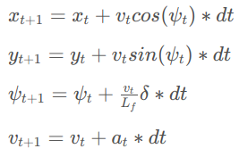

# Udacity self-driving car project 5 term 2, Model Predictive Control 
## The model
The state is represented as [x,y,\psi,v]
i.e the position, the angle and the current speed.
Beside these our model also need to keep track of the errors, Cross Track Error(cte) and \psi error (epsi).
The actuators is, as in a real car, throttle and steering angle. To update these we can use the equations:
<figure>
    
    <figcaption>(Image from lesson 18:5)</figcaption>
</figure>

## Timestep Length and Elapsed Duration (N & dt)

Basically I just started out with N=10 and dt=.1 as it was recommended in the QA video, I also tried a few other, for example 20/0.5 as in lesson 19/5, which obviously is really bad.
See the twiddle chapter below how I tried out even more options.
This resulted in N=9, dt=0.0875

## MPC preprocessing

As was done in the QA video, I also ended up recalculate the waypoints to the cars coordinate system to easier calculate other stuff.
One thing that could make it better would be to use interpolation to get more points near the car.

## Model predictive Control with Latency

This can easily be solved by trying to figure out where we would be at the point after the delay, in this case 100ms, and just feed our mpc algorithm with this as a starting point.
to do this we can first use the equation above to calculate positions, but we also need to calculate the expected error, Here's the code for this part:
```cpp
          double psi_t1 = (v_t1 / Lf) * -steer_value * (latency_s); 
          double x_t1 = average_v * cos(psi_t1/2) * (latency_s);
          double y_t1 = average_v * sin(psi_t1/2) * (latency_s); 
          double cte_t1 = cte + average_v * sin(psi_t1/2) * (latency_s);
          double epsi_t1 = epsi + (v_t1 / Lf) * -steer_value * (latency_s); 
          state << x_t1, y_t1, psi_t1, 
                    v_t1, cte_t1, epsi_t1;
```

## Optimizing the parameters with twiddle

To optimize the parameters, I could just sit and try until it's better, but that's pretty boring! So instead I took the twiddle part from the last project, unfortunately I noted that the simulate didn't handle the reset option that worked in the pid project.. so I also modified the simulator to handle this. This can be found here: <A href=https://github.com/henrisve/self-driving-car-sim> https://github.com/henrisve/self-driving-car-sim</a>
or in this repo, buildlinux.zip (only linux version).
Beside the reset I added the possibility to use it in a headless version (by using -batchmode) that could run about 3 times faster (faster than this and the latency in running the mpc code was too long).
I put the algorithm to only optimize for speed, and if the cte went above 3, it would reset and get 0 points. (cte = 3 is about just before the curb, so it could go on the paint).
This resulted in an average speed of about 65 and a top speed of almost 95.

I used twiddle for all the parameters, including weights and N/dt.

After doing this I realized that twiddle perhaps wasn't the best optimization for this, as it's really good at getting stuck in local optimize as it only adjust one parameter at each time. So even with this I could easily adjust by hand to move it to an better position etc.
Perhaps using a genetic algorithm could be fun to try.

One more problem I realized just before submitting was that for some reason the simulator I build was much much faster, so each loop took over 160 ms on my computer compared to 120 with my simulator (100ms is the set delay). So for this I had to reduce the speed and further set some of the parameters manually anyway....

## Other

To make it take the curves better, I also measured how the curve was, this was done in a simple way by measuring the y value in the end of the mpc prediction. Then I changed the cte cost to 
```
 mpc_params[1] *CppAD::pow(vars[cte_start + i] + mpc_params[10]*last_y,2)
```
where y is the y in the end of mpc in the cars coordinate system.
This allow the car to go closer to the inner part of the curve.

##

# Original readme below
# CarND-Controls-MPC
Self-Driving Car Engineer Nanodegree Program

---

## Dependencies

* cmake >= 3.5
 * All OSes: [click here for installation instructions](https://cmake.org/install/)
* make >= 4.1(mac, linux), 3.81(Windows)
  * Linux: make is installed by default on most Linux distros
  * Mac: [install Xcode command line tools to get make](https://developer.apple.com/xcode/features/)
  * Windows: [Click here for installation instructions](http://gnuwin32.sourceforge.net/packages/make.htm)
* gcc/g++ >= 5.4
  * Linux: gcc / g++ is installed by default on most Linux distros
  * Mac: same deal as make - [install Xcode command line tools]((https://developer.apple.com/xcode/features/)
  * Windows: recommend using [MinGW](http://www.mingw.org/)
* [uWebSockets](https://github.com/uWebSockets/uWebSockets)
  * Run either `install-mac.sh` or `install-ubuntu.sh`.
  * If you install from source, checkout to commit `e94b6e1`, i.e.
    ```
    git clone https://github.com/uWebSockets/uWebSockets
    cd uWebSockets
    git checkout e94b6e1
    ```
    Some function signatures have changed in v0.14.x. See [this PR](https://github.com/udacity/CarND-MPC-Project/pull/3) for more details.

* **Ipopt and CppAD:** Please refer to [this document](https://github.com/udacity/CarND-MPC-Project/blob/master/install_Ipopt_CppAD.md) for installation instructions.
* [Eigen](http://eigen.tuxfamily.org/index.php?title=Main_Page). This is already part of the repo so you shouldn't have to worry about it.
* Simulator. You can download these from the [releases tab](https://github.com/udacity/self-driving-car-sim/releases).
* Not a dependency but read the [DATA.md](./DATA.md) for a description of the data sent back from the simulator.


## Basic Build Instructions

1. Clone this repo.
2. Make a build directory: `mkdir build && cd build`
3. Compile: `cmake .. && make`
4. Run it: `./mpc`.

## Tips

1. It's recommended to test the MPC on basic examples to see if your implementation behaves as desired. One possible example
is the vehicle starting offset of a straight line (reference). If the MPC implementation is correct, after some number of timesteps
(not too many) it should find and track the reference line.
2. The `lake_track_waypoints.csv` file has the waypoints of the lake track. You could use this to fit polynomials and points and see of how well your model tracks curve. NOTE: This file might be not completely in sync with the simulator so your solution should NOT depend on it.
3. For visualization this C++ [matplotlib wrapper](https://github.com/lava/matplotlib-cpp) could be helpful.)
4.  Tips for setting up your environment are available [here](https://classroom.udacity.com/nanodegrees/nd013/parts/40f38239-66b6-46ec-ae68-03afd8a601c8/modules/0949fca6-b379-42af-a919-ee50aa304e6a/lessons/f758c44c-5e40-4e01-93b5-1a82aa4e044f/concepts/23d376c7-0195-4276-bdf0-e02f1f3c665d)
5. **VM Latency:** Some students have reported differences in behavior using VM's ostensibly a result of latency.  Please let us know if issues arise as a result of a VM environment.

## Editor Settings

We've purposefully kept editor configuration files out of this repo in order to
keep it as simple and environment agnostic as possible. However, we recommend
using the following settings:

* indent using spaces
* set tab width to 2 spaces (keeps the matrices in source code aligned)

## Code Style

Please (do your best to) stick to [Google's C++ style guide](https://google.github.io/styleguide/cppguide.html).

## Project Instructions and Rubric

Note: regardless of the changes you make, your project must be buildable using
cmake and make!

More information is only accessible by people who are already enrolled in Term 2
of CarND. If you are enrolled, see [the project page](https://classroom.udacity.com/nanodegrees/nd013/parts/40f38239-66b6-46ec-ae68-03afd8a601c8/modules/f1820894-8322-4bb3-81aa-b26b3c6dcbaf/lessons/b1ff3be0-c904-438e-aad3-2b5379f0e0c3/concepts/1a2255a0-e23c-44cf-8d41-39b8a3c8264a)
for instructions and the project rubric.

## Hints!

* You don't have to follow this directory structure, but if you do, your work
  will span all of the .cpp files here. Keep an eye out for TODOs.

## Call for IDE Profiles Pull Requests

Help your fellow students!

We decided to create Makefiles with cmake to keep this project as platform
agnostic as possible. Similarly, we omitted IDE profiles in order to we ensure
that students don't feel pressured to use one IDE or another.

However! I'd love to help people get up and running with their IDEs of choice.
If you've created a profile for an IDE that you think other students would
appreciate, we'd love to have you add the requisite profile files and
instructions to ide_profiles/. For example if you wanted to add a VS Code
profile, you'd add:

* /ide_profiles/vscode/.vscode
* /ide_profiles/vscode/README.md

The README should explain what the profile does, how to take advantage of it,
and how to install it.

Frankly, I've never been involved in a project with multiple IDE profiles
before. I believe the best way to handle this would be to keep them out of the
repo root to avoid clutter. My expectation is that most profiles will include
instructions to copy files to a new location to get picked up by the IDE, but
that's just a guess.

One last note here: regardless of the IDE used, every submitted project must
still be compilable with cmake and make./

## How to write a README
A well written README file can enhance your project and portfolio.  Develop your abilities to create professional README files by completing [this free course](https://www.udacity.com/course/writing-readmes--ud777).
